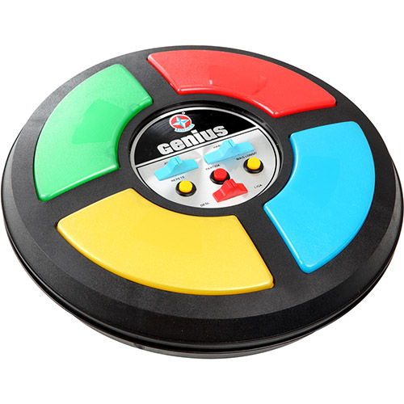
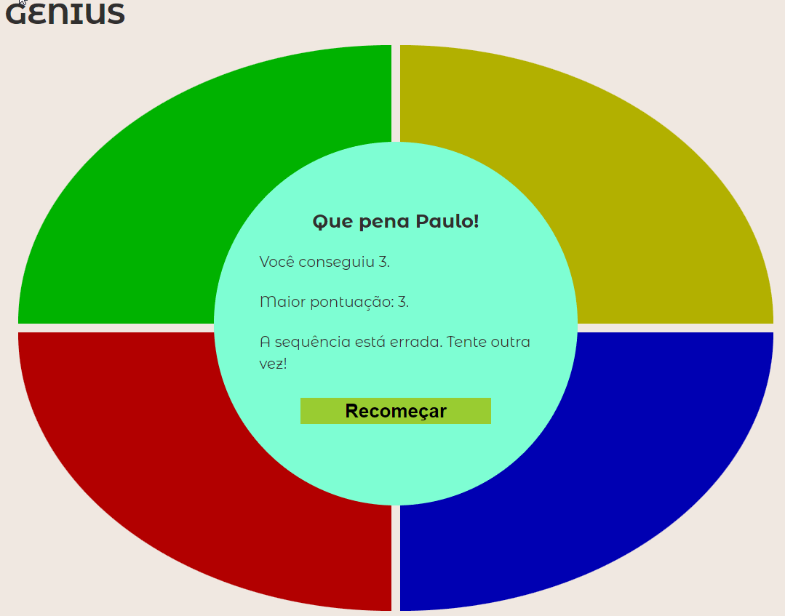

# Entrega: Jogo GENIUS

## Introdução

Jogo da memória criado na década de 80, em que aleatoriamente será apresentado uma sequência de luzes e o usuário deverá repetir a sequência sorteada.

## Tarefa

Essa entrega será realizada em dupla. Você e seu parceiro criará o jogo **GENIUS**

### Regras do jogo

O PC sorteará aleatoriamente uma sequência de cores que o usuário deverá repeti-las na ordem correta.

A cada rodada aumentará uma cor sorteada na sequência, por exemplo:

- 1ª rodada - sorteado a cor “AZUL”;
- 2ª rodada - sorteado a cor “AMARELA”, com isso a cor “AZUL” permanece e ficará a seguinte sequência - AZUL - AMARELO;
- 3ª rodada - sorteado a cor “VERDE”, sendo assim a sequência será a seguinte - AZUL - AMARELO - VERDE;

Assim por diante , até que o usuário erre a sequência.

### Interface

É possível criar diferentes versões do jogo, mas esse é o **exemplo** do jogo original.

- O jogo deverá ter alguma representação gráfica dos botões com as luzes;
- Na página deverá mostrar um feedback para o usuário quando ele deverá jogar e se ele acertou a sequência;
- O resultado da jogada deverá ser mostrado na tela;</li>
- O jogo deverá ter um botão de "Jogar novamente" para realizar uma nova tentativa.

    **IMPORTANTE!**
        O layout do jogo apresentado acima é apenas um modelo.
        NÃO é obrigatório reproduzir o mesmo layout apresentado.
        O ideal é que vocês criem um layout própria da dupla, respeitando o funcionamento do jogo.

    **Dicas!**
        Para que vocês consigam realizar o trabalho de forma mais fluída.Vamos deixar aqui algumas dicas:

            - Defina um tema para o seu jogo: pense em um layout que deixe o jogo bem intuitivo para o usuário;
            - Desenvolva o layout: pode utilizar ferramentas como o FIGMA para criar um jogo bem bonito, seguindo as cores que combinem com o tema escolhido. Assim vocês terão insights de como ficará a "cara" do jogo;
            - Tente criar toda a lógica do jogo: qual será o fluxo da sua aplicação, com começo, meio e fim. Por exemplo: quando o jogo começar, o que será apresentado? O jogador acertou toda a sequência, e agora, qual o próximo passo? Se o jogador errar, o que eu faço?
            - E por fim, comece a <code>CODAR</code>.</li>

        Lembrando que SÃO apenas dicas. Não é obrigatório seguir essa estrutura passo-a-passo.

## Envio

Faça o push do código para o seu repositório GitHub e implemente-o GitHub pages. No Canvas, por favor, **envie sua url do GitHub Pages: (ex: https://nomedeusuario.github.io/<nome_do_projeto>)** e envie o link do seu repositório nos comentários. Deixe o link do seu repositório como **Internal**.
